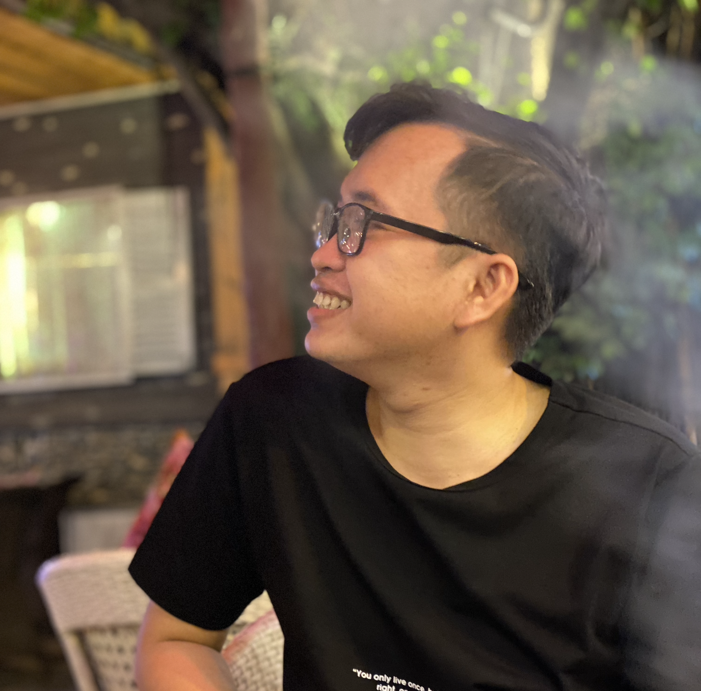

 

James(Minh Vuong) M.

>## Objective
***
*Become a software engineer capable of solving project problems, able to work in team. Learning to know, learning to be, learning to do and learning to live together.*

>## Education
***
HO CHI MINH UNIVERSITY OF SCIENCE `Sep, 2012 - Oct, 2016` 
The Faculty of Information Technology, major in Software Engineering.
&nbsp;

>## Work Experience
***
**FREELANCER** `Apr, 2015 - Nov, 2018`

**ADT SAIGON** `Apr, 2016 - Nov, 2018` 
- Developed and implemented all marketing campaigns.
- Maximized efficiency of PR contents on social channels: Facebook, Zalo, website...

**FS Co.,Ltd** `Nov, 2018 - Dec, 2019` 
*Junior ASP.NET Developer*
- Working with Microsoft Entity Framework and SQL Server to maintain and enhance data Framework.
- Develop and support application systems in accordance with establish standards and processes.
- Developing and maintaining web based applications written in traditional ASP.NET and MVC5 as well as heavily utilising windows Workflow Foundation.

**eB2B** `Apr, 2020 - Nov, 2020` 
*Junior Angular Developer*
- Working knowledge of front end optimization and performance techniques.
- Makes design recommendations towards the development of new code or reuse of existing code.
- Developing and Administer the new Angular based website.
- Talking an active role in structuring our single page applications to make them easy to maintain and to ensure they are highly modularized.
- Projects: [etop.vn](https://etop.vn), etop app, Github Insight.

**ECR Vietnam Co.,Ltd** `Nov, 2020 - Now` 
*Frontend Team Lead*
- Working knowledge of front end optimization and performance techniques.
- Makes design recommendations towards the development of new code or reuse of existing code.
- Developing and Administer the new Angular based website.
- Talking an active role in structuring our single page applications to make them easy to maintain and to ensure they are highly modularized.
- NodeJS as maintained in Express.
- Using MongoDB and Postgres on the Back end.
- JavaScript framework experience in NodeJS.
- Experience RESTful design and development.
- Projects: 4Oranges Sale Audit, ECR Your Stock, ECR Your Ticketing.

>## Skills
***
- TypeScript, Angular, HTML, CSS, JavaScript...
- Leading team, breakdown requirements and estimate.
- Teamwork.
- Problem solving.
- Critical thinking.
